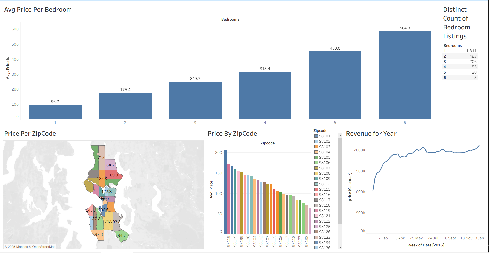

# Airbnb Price & Revenue Analysis — Seattle Market (Tableau Dashboard)

This project analyzes Airbnb listing data to uncover pricing trends, revenue patterns, and location-based variations across Seattle. Built in Tableau, the dashboard reveals how bedroom count, zip code, and seasonal demand influence pricing and revenue behavior.

The dashboard is designed to help for Airbnb hosts optimize pricing, Travelers understand market patterns, Investors identify high-value areas, Analysts study occupancy and revenue behaviors

Live Dashboard: 
https://public.tableau.com/app/profile/akshay.gunnala1566/viz/AirBnBFullProject_17635801052510/Dashboard1

---

## Project Objectives

- Analyze average price in relation to bedroom count
- Compare price differences across Seattle zip codes
- Understand neighborhood-level pricing patterns using maps
- Analyze revenue trends week-by-week for 2016
- Build an interactive dashboard combining charts, maps

---

## Dataset Overview

The dataset includes:

- **Listing details**: bedrooms, listing ID, price
- **Geographic data**: zip codes, latitude/longitude
- **Calendar data**: weekly revenue
- Additional fields from the original Airbnb dataset

---

## Dashboard Preview

---

## Dashboard Components

### 1. Avg Price per Bedroom
Bar chart showing how average price increases with bedroom count.

**Key insights**:
- Prices rise steadily from 1 to 6 bedrooms
- 6-bedroom listings average ~$585
- 1-bedroom listings are most common (~1,800+)

---

### 2. Price per Zip Code (Map)
Filled map of Seattle showing average prices by zip code.

**Key insights**:
- Clear regional pricing patterns

---

### 3. Price by Zip Code (Bar Chart)
Bar chart comparing average prices across all zip codes.

**Key insights**:
- Highlights top-performing and underperforming regions
- Useful for location-based pricing strategy

---

### 4. Revenue for Year (Line Chart)
Time-series chart showing weekly revenue trends for 2016.

**Key insights**:
- Strong growth early in the year
- Seasonal patterns visible across months

---

## Insights & Takeaways

- **Bedroom count** drives pricing: larger homes earn higher nightly rates
- **Zip code** is a key pricing factor: some neighborhoods consistently outperform
- **Revenue trends** show seasonality and growth patterns
- **Market density**: 1–2 bedroom listings dominate, indicating high competition

---

## Tools Used

- **Tableau Public** — dashboard creation & visualization
- **Excel / CSV** — data cleaning and prep

---

## Why This Project Matters
This Tableau dashboard provides actionable insights for:
1. Hosts optimizing pricing strategy
2. Analysts evaluating market behavior
3. Travelers comparing location-based pricing
4. Stakeholders studying real estate or rental trends

## Summary of this Project 
- This project showcases my ability to clean real data, uncover insights, and build interactive dashboards in Tableau that support business decision-making.